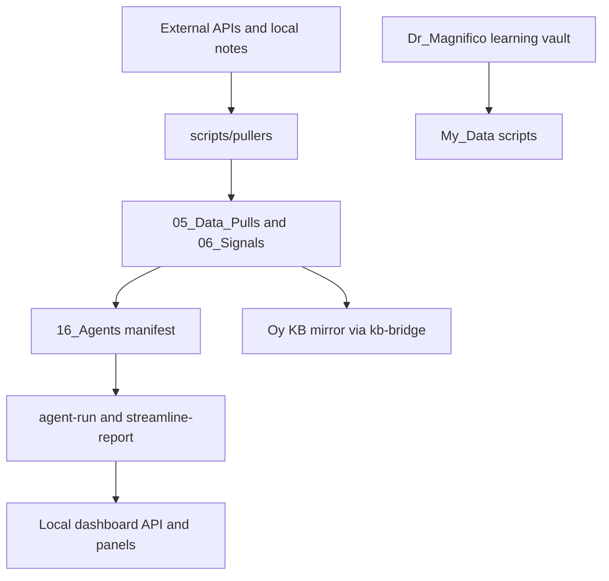

# Project Architecture, Working State, Fixes, and Roadmap

## Architecture

My_Data is the execution engine for a three-vault research system. Scripts run from `scripts/`, read configuration from `.env`, and write vault-native markdown plus sidecar JSON into cache folders.

## Working

- Grouped CLI routing through `node run.mjs <group> <command>`.
- FMP quote, technical, calendar, watchlist, fundamentals, insider, short-interest, options, and screener workflows.
- Agent manifest, agent-run ledger, interaction threads, and Streamline Report.
- Confluence, signal-quality, entropy, sector, thesis, catalyst, macro bridge, company-risk, OSINT, and KB/learning routing surfaces.
- Positioning Agent scorer, report, watchlist, sidecar, Streamline section, and dashboard endpoint/panel.

## Needs Fixed Or Improved

- OSINT remains source-dependent and should wait for better data/vendor choices.
- Confluence scoring needs a focused review against recent notes and expected setup counts.
- Positioning needs richer FMP institutional ownership, ETF holder, and short-interest extraction.
- AVWAP should use last earnings date as an anchor and be reused by confluence, PEAD, and positioning.
- Streamline and dashboard coverage should converge around a single sidecar contract for all specialist agents.

## Roadmap

1. Add FMP institutional/ETF ownership pull notes and feed them into `positioning-report`.
2. Add last-earnings AVWAP fields to FMP technical snapshots or a shared market-structure helper.
3. Repair confluence scan source grouping and add regression tests around expected setup promotion.
4. Add outcome review links from positioning signals to 5/20/60-day follow-up notes.
5. Expand dashboard drilldowns for positioning, confluence lineage, and agent interaction threads.
