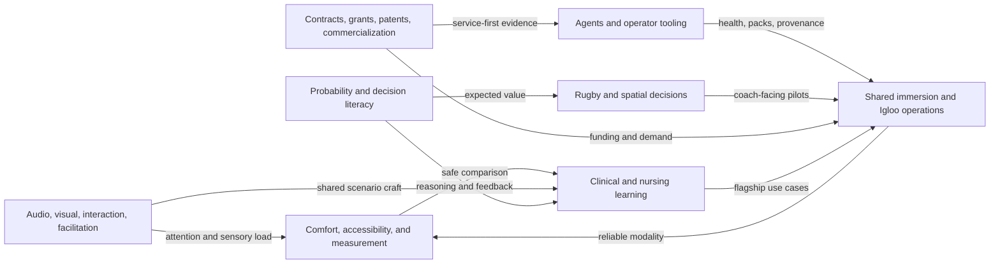

# CyberSickness History Synthesis and Project Portfolio

> [!abstract] Executive conclusion
> The archive is not mainly a collection of unrelated XR ideas. Its durable spine is **making complex, dynamic systems understandable in shared immersive environments** while preserving comfort, accessibility, operator reliability, and evidence. The best near-term move is one compound studio cycle: stabilize delivery, use the faculty accelerator to run one comparative clinical or decision-learning pilot, and capture outputs as reusable session packs and evidence--not five parallel ventures.

## At a glance

| Measure | Result |
| --- | --- |
| Conversations | 647 unique; all seven shards reconciled (100/100/100/100/100/100/47) |
| Date range | 2025-08-05 through 2026-07-27 (UTC export dates) |
| Messages | 17,151 unique message IDs; 16,969 current-branch and 182 alternate-branch messages |
| Attachments | 598 exported binaries; 22 library-only records; 86 conversation-reference-only IDs; 706 catalog rows |
| Substantive attachment review | 8 Markdown files content-reviewed; 6 DOCX files text-reviewed; remaining records catalog-only |
| Privacy | No transcripts or binaries copied; conclusions paraphrased; direct contact and unnecessarily sensitive details omitted |

## Executive conclusions

1. **Reliability is strategic, not merely technical.** Lost curriculum and a stated 60-70 percent historical uptime make operator evidence, known-good sessions, and fallbacks prerequisites for adoption and research.
2. **Shared projection, headset XR, and non-XR simulation are different treatments.** The later archive explicitly distinguishes co-located room-scale immersion from headsets; studies and product claims should do the same.
3. **Cybersickness is a cross-cutting quality layer.** It connects modality choice, exposure, audiovisual intensity, accessibility, breaks, recovery, and honest reporting; it should be embedded across pilots rather than sold first as an isolated toolkit.
4. **Clinical learning is the strongest flagship domain.** It has real scenarios, a completed shared-room implementation artifact, a narrow medication-calculation wedge, and a credible research/funding path--while still lacking controlled efficacy evidence.
5. **Commercialization is service-first.** The recurring viable pattern is manual domain service -> provenance-backed deliverable -> reusable runbook -> internal automation -> product only after repetition.
6. **Quant, rugby, and games are not distractions when treated as decision laboratories.** They share scenario, probability, consequence, replay, and reflection mechanics with clinical learning.

## Top five projects

| Rank | Project | Score | Tier | Recommended disposition |
| --- | --- | --- | --- | --- |
| 1 | [[Projects/01 Igloo Operator Toolkit and Session Pack System\|Igloo Operator Toolkit and Session Pack System]] | 90 | Build now | Build a read-only, one-site pilot first; productization waits for repeated use and buyer interviews. |
| 2 | [[Projects/02 Igloo Research Studio and Faculty Accelerator\|Igloo Research Studio and Faculty Project Accelerator]] | 89.5 | Build now | Run one clinical or decision-learning cycle; do not launch a broad lab program before capacity is measured. |
| 3 | [[Projects/03 Interactive Nursing Calculations Lab\|Interactive Nursing Calculations Lab with Small-Dose XR]] | 85 | Build now | Build one calculation progression with a nursing SME; defer XR until the browser assessment works. |
| 4 | [[Projects/04 XR Opportunity and Bid Intelligence Engine\|XR Opportunity and Bid Intelligence Engine]] | 83.5 | Build now | Use it internally to qualify one real opportunity; do not sell a generic RFP product yet. |
| 5 | [[Projects/05 Comparative XR Shared-Room and Non-XR Research Kit\|Comparative XR, Shared-Room, and Non-XR Simulation Research Kit]] | 81.5 | Build now | Choose one existing scenario and one comparator; pursue approvals and funding only after the protocol is bounded. |

> [!important] One 30-day commitment
> Combine projects 1, 2, and 5 into one bounded operating proof: prepare one known-good session pack, admit one faculty scenario through the accelerator, and rehearse one comparative protocol with comfort/accessibility fields. Build the browser-only nursing module as a separate small lane only if capacity remains. Use the opportunity engine to fund the work, not to create another platform.

## Connection map

See [[02 Theme Map]] for the evidence-backed connection ledger.

## Read the dossier

- [[01 Detailed Content Report]] -- full history, themes, pivots, assets, gaps, and interpretation.
- [[Projects/04 External View and Topic Flow]] -- outsider's view of the topic flow, underlying interests, strengths, tensions, and strategic identity.
- [[02 Theme Map]] -- cross-theme relationships and evidence pairs.
- [[03 Ranked Project Portfolio]] -- rubric, all candidates, score rationales, and portfolio sequencing.

### Themes

- [[Themes/Cybersickness Comfort Accessibility and Comparison|Cybersickness, comfort, accessibility, and XR/non-XR comparison]]
- [[Themes/Shared Immersive Systems and Igloo|Shared immersive systems, Igloo, and experience engineering]]
- [[Themes/Clinical Simulation Nursing and Interactive Learning|Clinical simulation, nursing education, and interactive learning]]
- [[Themes/Immersive Analytics Rugby and Spatial Decisions|Immersive analytics, rugby, games, and spatial decision-making]]
- [[Themes/AI Agents Automation and Operator Tools|AI agents, automation, and reusable operator tools]]
- [[Themes/Quant Probability and Decision Literacy|Quant finance, probability, and decision-literacy experiences]]
- [[Themes/Patents Contracts Grants and Commercialization|Patent discovery, products, contracts, grants, and commercialization]]
- [[Themes/Audio Visual Interaction and Facilitation Design|Audio, visual, interaction, and facilitation design]]

### Sources and audit trail

- [[Sources/Conversation Index]]
- [[Sources/Attachment Index]]
- [[Sources/Evidence Register]]
- [[Sources/CS Part 2 Duplicate Audit]]
- [[Sources/Methodology and Limitations]]
- [[Sources/Verification Report]]

## Evidence boundary

Archive records are classified as user-originated direction, assistant-generated proposal, attached artifact, or externally verified fact. An assistant proposal is evidence that an idea was generated--not that its factual claims, build status, or market assumptions are true. Current primary-source checks are dated, linked, and kept separate in the evidence register.
