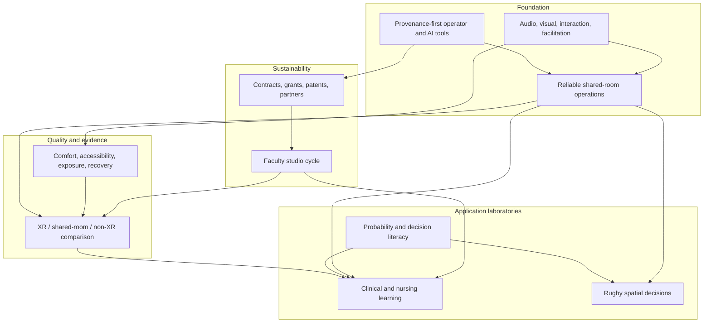

# CyberSickness Theme Map

[[00 CyberSickness Hub|Back to hub]]  /  [[01 Detailed Content Report]]  /  [[Sources/Evidence Register]]

## System view

## High-confidence connection ledger

Every connection below has at least two current-branch or reviewed-attachment records. Descriptions are paraphrases; provenance is exact.

| Connection | Evidence A | Evidence B | Interpretation |
| --- | --- | --- | --- |
| Reliability -> adoption and valid research | **Memory leak troubleshooting steps** (2025-11-13; `691649eb-166c-8325-86f1-b71b43df24bf`; `conversations-001.json`) | **2026 Session Booking Targets** (2026-02-12; `698e457a-becc-832d-8823-66f98b097422`; `conversations-002.json`) | A failed or unstable delivery layer changes exposure, completion, and learner experience; uptime and recovery must be captured as study and service evidence. |
| Shared immersion <-> comfort/accessibility | **XR vs non-XR simulation** (2025-09-30; `68dc04da-aa28-832a-b0f3-42f16b7d50f0`; `conversations-000.json`) | **Feedback on Abstract** (2026-07-22; `6a612c80-235c-83ea-92e2-130980fdfacc`; `conversations-006.json`) | The archive distinguishes headset vestibular exposure from shared-room sensory and social immersion; both require explicit but different quality fields. |
| Templates -> faculty acceleration | **Igloo Vision Demo Guide** (2026-06-07; `6a25c3f9-2414-8327-bd19-89ad0e59e724`; `conversations-005.json`) | **IDP for Spatial Computing** (2026-06-27; `6a3fc6aa-dffc-83ea-af22-bc7278cf2910`; `conversations-005.json`) | Reusable dashboard/timeline/static tiers plus governed intake reduce the queue of bespoke builds. |
| Operator tooling -> one-person scalability | **Igloo Agent Checklist** (2026-04-20; `69e64ad9-5924-83ea-892c-e8d72b6c7364`; `conversations-003.json`) | **AI Scripts for Igloos** (2026-06-17; `6a32b3ef-a4e4-83e8-b04d-2f0c63b179bc`; `conversations-005.json`) | Read-only health evidence and bounded pack/interaction tools are the repeated mechanism for lowering support burden. |
| Audiovisual craft -> learning and stress | **White Rose Audio Resources** (2026-02-28; `69a2395d-c9c4-8328-a971-b5de941773b3`; `conversations-002.json`) | **Feedback on Abstract** (2026-07-22; `6a612c80-235c-83ea-92e2-130980fdfacc`; `conversations-006.json`) | Scene-specific media and deliberately distracting clinical environments show that audio/visual choices are instructional variables. |
| Clinical scenarios -> comparative research | **Immersive simulation cleanup** (2025-12-10; `6939d2c2-a85c-8330-b27a-199247369fbe`; `conversations-001.json`) | **XR vs non-XR simulation** (2025-09-30; `68dc04da-aa28-832a-b0f3-42f16b7d50f0`; `conversations-000.json`) | Reusable scenario and survey structures create the stable content needed to compare modalities rather than comparing unrelated experiences. |
| Probability -> rugby decisions | **Options as Probability** (2026-02-14; `69908059-faf0-8328-9f4b-c83f983176da`; `conversations-002.json`) | **Risk-Based Rugby System** (2026-05-31; `6a1cb35d-df0c-8326-870f-f7a3348d847d`; `conversations-005.json`) | Distribution and expected-value thinking become concrete when mapped to field location, score, time, and tactical alternatives. |
| Decision literacy -> nursing reasoning | **EV Mastery Learning Ladder** (2026-07-01; `6a446403-7614-83ea-a0c6-6e1d8d18b179`; `conversations-005.json`) | **Interactive Learning Topics** (2026-07-22; `6a60309b-b564-83ea-b491-6918ddf271b9`; `conversations-006.json`) | Prerequisite gates and first-error diagnosis share a visible-reasoning, consequence, feedback, and reassessment loop. |
| AI provenance -> patents and procurement | **Patent Discovery Strategy** (2026-07-01; `6a454f6f-c138-83ea-8c35-5479100ba542`; `conversations-005.json`) | **XR Immersive Learning Contracts** (2026-06-17; `6a31ee73-c2bc-83e8-a1a6-3e64c7a5c177`; `conversations-005.json`) | Both lanes require current sources, deterministic filters, uncertainty flags, and a human decision gate. |
| Service studio -> reusable platform assets | **XR studio business plan** (2025-12-19; `6945675a-e938-832a-b96c-70b9e1081ed6`; `conversations-001.json`) | **Igloo_Project_Partnership_Agreement_and_Transition_Work_Plan_Unified_Design.docx** (2026-07-23; `file_0000000003b4822fbab0cace70e55c7c`; text-reviewed) | A bounded partnership cycle creates packs, runbooks, and evidence that can compound without assuming a software market. |
| Multicampus ambition -> governance | **Igloo Immersive Spaces Routing** (2026-07-15; `6a57d40f-caac-83ea-ab1b-c4c7c60fe5e9`; `conversations-006.json`) | **Igloo_Immersive_Spaces_Platform_Engineering_Roadmap.docx** (2026-06-30; `file_0000000099c4720cb1ae456daf50aa56`; text-reviewed) | Multiple rooms make versioning, read-only masters, compatibility checks, training, and site-specific adapters necessary. |
| Rugby replay -> shared spatial facilitation | **Rugby 3D Replay Pitch** (2026-07-15; `6a581841-6008-83ea-b852-e50570c20f9d`; `conversations-006.json`) | **Audience Interaction Architecture** (2026-06-17; `6a32bd5b-4548-83e8-8c15-859e92215dbd`; `conversations-005.json`) | A coach-facing spatial review benefits from facilitated shared viewing and controlled interaction before expensive automation. |

## Canonical theme notes

- [[Themes/Cybersickness Comfort Accessibility and Comparison|Cybersickness, comfort, accessibility, and XR/non-XR comparison]] -- Cybersickness is not the archive's most frequent subject; it is the safety, accessibility, and measurement layer that decides when headset XR is appropriate, when shared projection is preferable, and how immersive claims should be evaluated.
- [[Themes/Shared Immersive Systems and Igloo|Shared immersive systems, Igloo, and experience engineering]] -- The shared-immersive work matures from impressive one-off demos into a reliability-first platform: known-good sessions, reusable templates, structured intake, operator controls, evidence capture, and only a bounded lane for advanced builds.
- [[Themes/Clinical Simulation Nursing and Interactive Learning|Clinical simulation, nursing education, and interactive learning]] -- Clinical and nursing work becomes most executable when it uses a reusable production pipeline and a narrow mastery problem: visible reasoning, deterministic feedback, facilitator support, and optional spatial practice where scale or sequence matters.
- [[Themes/Immersive Analytics Rugby and Spatial Decisions|Immersive analytics, rugby, games, and spatial decision-making]] -- Rugby evolves from coaching content into a decision laboratory combining expected value, spatial channels, match context, manual annotation, and low-cost 3D replay for a real practitioner community.
- [[Themes/AI Agents Automation and Operator Tools|AI agents, automation, and reusable operator tools]] -- Across XR operations, markets, patents, and procurement, the same useful spine repeats: ingest, normalize, preserve provenance, score, route to human review, publish a decision artifact, and refresh on a schedule.
- [[Themes/Quant Probability and Decision Literacy|Quant finance, probability, and decision-literacy experiences]] -- The durable quant idea is decision literacy--making uncertainty, risk, incentives, and consequences visible--not selling an autonomous trading system.
- [[Themes/Patents Contracts Grants and Commercialization|Patent discovery, products, contracts, grants, and commercialization]] -- Commercialization repeatedly converges on service first: solve one domain problem manually, deliver a provenance-backed packet, automate repeated work internally, and expose software only after demand is observed.
- [[Themes/Audio Visual Interaction and Facilitation Design|Audio, visual, interaction, and facilitation design]] -- Audio, imagery, projection geometry, interaction, and facilitation are not polish; they are instructional and operational variables that shape attention, stress, group coordination, and comfort.

## Boundary rules

- One canonical theme owns each synthesis; overlaps are expressed with tags and wikilinks.
- Headset XR, shared projection, and non-XR simulation remain separate modalities even when one project uses all three.
- Technologies such as TouchDesigner, WebXR, game engines, Gaussian splats, and computer vision are implementation choices inside a problem-led project.
- AI tooling, PatentAgent, and opportunity monitoring are shared infrastructure unless a vertical buyer validates a standalone offer.
