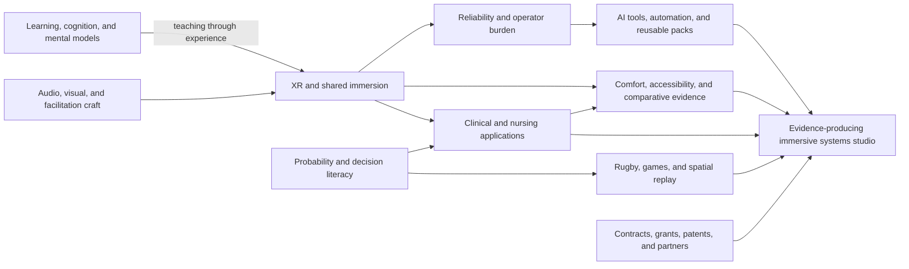

# External View and Topic Flow

[[00 CyberSickness Hub|Back to hub]] / [[01 Detailed Content Report]] / [[02 Theme Map]] / [[03 Ranked Project Portfolio]]

> [!summary] External read in one sentence
> From the outside, this is not primarily a collection of XR projects. It is the work of a **systems-oriented learning and experience designer trying to make difficult decisions visible, teachable, measurable, and reusable across shared immersive environments**.

## How to read this note

This is a cold strategic interpretation of the patterns in the archive. It is not a personality assessment, a new market survey, or proof that every generated idea has been implemented. It asks: if an informed outsider saw only the recurring topics, corrections, pivots, and constraints, what coherent body of work would they think was forming?

## Summary flow of the interests

The flow is cumulative rather than linear. New interests are usually added as another test case for the same underlying system. Rugby does not replace clinical learning; it tests whether spatial decision tools transfer. Quant does not replace XR; it supplies models of uncertainty and consequence. AI does not become the mission; it becomes the operating leverage. Cybersickness does not become a separate product by default; it becomes the quality and evidence boundary.

## Topic evolution over time

| Period | Visible focus | What an outsider would infer was changing |
| --- | --- | --- |
| Aug-Sep 2025 | Immersive learning, cognition, White Rose, surgery, XR/non-XR studies | Exploration of where spatial media can genuinely improve understanding rather than merely impress. |
| Oct-Dec 2025 | NCLEX, clinical scenarios, XR mechanics, studio ideas | A move from medium-first curiosity toward applied learning problems and a possible service model. |
| Jan-Mar 2026 | Igloo plans, uptime targets, nursing tools, probability, Narcan, rugby prototypes | The work encounters operational reality while also discovering repeatable interaction and assessment patterns. |
| Apr-Jun 2026 | Health checks, automation, templates, session packs, audience input, platform roadmaps | The central problem shifts from creating experiences to making delivery reliable, reusable, governable, and supportable. |
| Jul 2026 | Nursing-calculation wedge, comparative research, bid intelligence, patents, rugby replay, studio identity | The archive starts consolidating around products, evidence, partnerships, and disciplined project selection. |

## Major topics through an external lens

| Major topic | Recurring interest beneath it | External interpretation | Main caution |
| --- | --- | --- | --- |
| [[Themes/Shared Immersive Systems and Igloo\|Shared immersion and Igloo]] | Co-located sensemaking, physical participation, and group facilitation | This is the operational and experiential home base, not simply a hardware specialty. | Reliability and support capacity can consume the creative and research mission. |
| [[Themes/Cybersickness Comfort Accessibility and Comparison\|Cybersickness, comfort, and accessibility]] | Choosing the right modality and measuring its cost to the learner | This is a mature quality instinct: ask when immersion is justified and for whom. | The archive contains more proposed measures than collected common data. |
| [[Themes/Clinical Simulation Nursing and Interactive Learning\|Clinical and nursing learning]] | High-stakes reasoning, practice, feedback, and transfer | This is the strongest flagship application because the learning problems are concrete and the institutional path is visible. | Positive reactions cannot be presented as objective learning efficacy. |
| [[Themes/AI Agents Automation and Operator Tools\|AI agents and operator tools]] | Reducing repeated labor while preserving provenance and human control | The useful AI identity is quiet infrastructure: checks, packs, evidence, routing, and decision support. | Generated specifications can create the appearance of completion before deployment is verified. |
| [[Themes/Quant Probability and Decision Literacy\|Probability and decision literacy]] | Making uncertainty, incentives, tradeoffs, and consequences legible | This is an intellectual engine that connects markets, nursing, rugby, and games. | It becomes diffuse when framed as a general quant platform or unvalidated trading product. |
| [[Themes/Immersive Analytics Rugby and Spatial Decisions\|Rugby, games, and spatial decisions]] | Embodied decision review, replay, and learning through consequences | This is a credible second domain for proving that the learning system transfers beyond healthcare. | Buyer access, footage rights, and coaching workflow fit remain unproven. |
| [[Themes/Audio Visual Interaction and Facilitation Design\|Audio, visual, interaction, and facilitation]] | Directing attention, stress, narrative, and group behavior | This is not decorative work; it is the experience-design grammar underneath the applications. | Intended stress and unintended discomfort need to be separated. |
| [[Themes/Patents Contracts Grants and Commercialization\|Patents, contracts, grants, and commercialization]] | Turning research and technical capability into sustainable work | The strongest commercial instinct is service-first and evidence-first, with software built after repetition. | Searches and opportunities are not customers, awards, or legal conclusions. |

## The deeper interests that keep recurring

### 1. Systems rather than isolated artifacts

The archive rarely stops at one experience. It asks how content is created, launched, controlled, measured, recovered, reused, taught to others, and supported across rooms. From outside, this reads as a platform and operating-model instinct.

### 2. Learning through consequential interaction

The favored experiences make a learner choose, calculate, coordinate, notice, or adapt. Whether the domain is medication calculations, rugby tactics, probability, or emergency response, the interest is not passive visualization. It is **decision -> consequence -> feedback -> reflection -> improved decision**.

### 3. Translation between disciplines

The work repeatedly transfers a pattern from one field into another: expected value into rugby; error tracing into nursing; audiovisual stress into simulation; provenance systems into patents and procurement. That cross-domain translation is one of the archive's most distinctive strengths.

### 4. Operational autonomy and leverage

There is a persistent desire to reduce dependence on opaque vendor support, repeated manual setup, and one-person heroics. Automation, templates, health checks, and session packs are expressions of the same interest: make complex work reproducible without making it reckless.

### 5. Evidence that survives the demo

The later archive increasingly asks for comparators, measures, source quality, limitations, acceptance tests, and transition plans. Externally, that suggests the work is moving from creative technologist toward research-and-product systems leadership.

### 6. Sustainable creative practice

Contracts, grants, studios, partnerships, patent research, and opportunity intelligence all address the same concern: how can ambitious work continue without depending on endless custom requests or speculative product building?

## What appears distinctive from the outside

- **A rare bridge between experience design and operations.** Many people can ideate immersive content; fewer treat uptime, facilitation, evidence, and handoff as part of the experience.
- **A real comparative instinct.** The archive repeatedly questions whether headset XR, shared projection, or non-XR delivery is actually the right treatment.
- **Domain range with a common mechanism.** Clinical education, rugby, finance, games, and audiovisual storytelling look broad, but they repeatedly converge on decisions under uncertainty.
- **A service-to-platform path.** The strongest business ideas start with a bounded human service and automate what repeats, which is more credible than leading with generic software.
- **Respect for human-in-the-loop control.** The best tooling concepts preserve provenance, explicit gates, and operator ownership.

## Tensions an outsider would notice

1. **Breadth is both the advantage and the risk.** The connections are real, but too many simultaneous manifestations can hide the core offer.
2. **The platform instinct arrives early.** The archive often designs the ecosystem before one user workflow has repeated three times.
3. **Operational responsibility competes with invention.** Reliability work is essential, but it can turn the role into AV/IT support unless scope and capacity are explicit.
4. **Artifact volume can be mistaken for traction.** Many strong assistant-generated plans exist; fewer have verified deployment, users, outcomes, or revenue.
5. **Research ambition needs a protocol bottleneck.** There are enough questions. The scarce resources are one comparator, one primary outcome, approvals, methods support, and reliable delivery.
6. **Commercial routes are still hypotheses.** Grants, contracts, faculty demand, coaches, and patent buyers are plausible channels but not interchangeable proof.
7. **The word 'XR' can obscure the actual value.** The value may be group sensemaking, error diagnosis, replay, facilitation, or evidence--sometimes delivered without a headset.

## The clearest external identity

> [!important] Suggested umbrella
> **Evidence-Producing Immersive Systems Studio**

That identity is more accurate than 'XR content studio,' 'AI company,' 'simulation lab,' or 'cybersickness project' alone. It accommodates the broad interdisciplinary ambition while forcing every cycle to produce durable evidence and reusable infrastructure.

| Layer | Purpose | What belongs here |
| --- | --- | --- |
| Foundation | Make delivery reliable, observable, and reusable | Operator toolkit, known-good sessions, templates, session packs, fallbacks, facilitator readiness, common quality fields |
| Flagship applications | Prove value in bounded real problems | Clinical/shared-room simulation, medication-calculation mastery, comparative XR/non-XR research |
| Transfer laboratories | Test whether the learning engine generalizes | Rugby decision replay, probability labs, one lesson-as-mechanic game, documentary/facilitation patterns |
| Growth engines | Find funded demand and partners | XR opportunity intelligence, partnerships, grants, evidence packets, carefully bounded patent research |
| Internal infrastructure | Preserve evidence and reduce repeated work | Ingestion, provenance, scoring, decision boards, source-quality checks, automation with human gates |

## How an outsider would prioritize the next 90 days

1. **Prove the foundation:** one room, one known-good session, one read-only readiness report, one fallback, and measured operator time.
2. **Run one flagship cycle:** admit one existing clinical scenario through the faculty accelerator and produce a reusable pack, facilitator kit, quality fields, and evidence summary.
3. **Bound one research protocol:** one modality comparison and one primary outcome; do not start with a large multi-arm study.
4. **Ship one non-immersive learning wedge:** prove the medication-calculation error-diagnosis loop in a browser before adding XR.
5. **Use commercial tooling internally:** qualify a real opportunity and create one bid/no-bid packet; keep PatentAgent and the research stack behind the service.
6. **Measure the studio itself:** cycle time, operator hours, reuse without the original builder, learner completion, evidence completeness, and the continuation decision.

## What should not be overstated

- The archive demonstrates continuity of interest and a substantial design asset base; it does not demonstrate a mature product portfolio.
- Shared-room enthusiasm and perceived value do not yet establish comparative learning efficacy.
- A technical specification is not a working implementation.
- A grant program, public opportunity, patent record, or possible partner is not revenue.
- The number of conversations in a theme does not measure its strategic importance.
- Cross-domain range is valuable only when the common engine becomes simpler and more reusable, not when it creates more parallel projects.

## Bottom line

An outsider would likely see someone evolving from an immersive-content generalist into a **research-studio and platform operator focused on decision learning**. The opportunity is not to choose one interest and discard the rest. It is to give the interests a hierarchy: reliable shared systems at the base, evidence and comfort across the middle, a few flagship learning problems at the top, and commercial research serving the whole structure.

The most credible proof is deliberately modest: **one reliable room, one reusable scenario, one comparative question, one measurable learning loop, and one funded or sponsored continuation decision.** If that cycle repeats, the broad archive becomes a defensible platform. If it does not, the result is still useful because the operating evidence will show what to narrow or stop.
